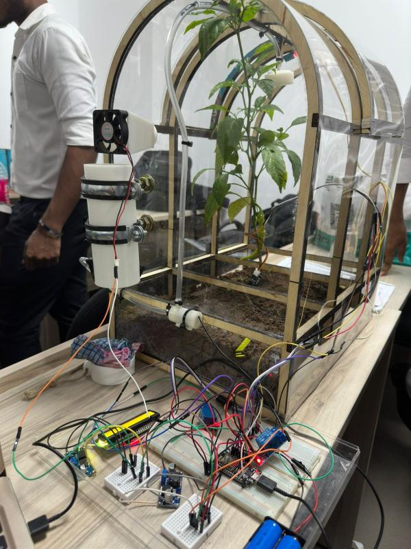
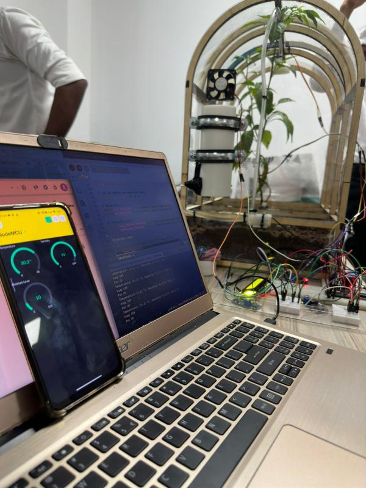

# 🌱 Smart Greenhouse IoT System

An IoT-based automation system designed to monitor and control greenhouse environmental conditions using ESP8266 and sensors.

---

## 🚀 Features
- Automated irrigation based on soil moisture levels  
- Temperature-controlled cooling fan system  
- Real-time monitoring via Blynk IoT platform  
- Manual override for pump and fan control  
- Live sensor data display (temperature, humidity, moisture)

---

## 🧠 My Contribution
- Implemented automation logic for irrigation system  
- Developed sensor integration (DHT11, soil moisture sensor)  
- Designed relay control system for pump and fan  
- Assisted in IoT cloud integration using Blynk  

---

## 🛠 Tech Stack
- ESP8266 NodeMCU  
- Arduino IDE (C++)  
- Blynk IoT Platform  
- DHT11 Sensor  
- Soil Moisture Sensor  
- Relay Module  
- Water Pump & Fan  

---

## 🖼 System Preview

  
  

---

## 📄 Project Report
Full documentation available in `/report` folder.

---

## 📌 Note
This is a university group project completed at SLIIT as part of the Fundamentals of Computing module.
